# ClinicSys Microservices System Design

## Overview
This document describes the architecture and service responsibilities for the ClinicSys platform, a microservices-based clinic management system for laser body shaving clinics.

---

## Architecture Diagram

```mermaid
graph TD
    subgraph API Gateway
        APIGW["API Gateway"]
    end
    subgraph Service Registry
        REG["Service Registry - Eureka"]
    end
    subgraph Auth
        AUTH["Auth Service"]
    end
    subgraph User
        USR["User Service"]
    end
    subgraph Clinic
        CLINIC["Clinic Service"]
    end
    subgraph Reservation
        RES["Reservation Service"]
    end
    subgraph Package
        PKG["Package/Program Service"]
    end
    subgraph Payment
        PAY["Payment Service"]
    end
    subgraph Notification
        NOTIF["Notification Service"]
    end
    subgraph Promo
        PROMO["Promo Code Service"]
    end
    subgraph Schedule
        SCHED["Schedule Service"]
    end
    subgraph Staff
        STAFF["Staff Service"]
    end
    subgraph Reporting
        REPORT["Reporting Service"]
    end
    subgraph Inventory
        INV["Inventory Service"]
    end
    subgraph MedicalHistory
        MEDHIST["MedicalHistory Service"]
    end
    subgraph Feedback
        FEED["Feedback Service"]
    end
    subgraph Wallet
        WALLET["Wallet Service"]
    end
    subgraph Referral
        REFERRAL["Referral Service"]
    end
    subgraph Audit
        AUDIT["Audit Service"]
    end
    subgraph MessageBus
        KAFKA(["Kafka"])
        RABBIT(["RabbitMQ"])
    end
    subgraph Cache
        REDIS(["Redis"])
    end
    subgraph DBs
        DBUSR[("User DB")]
        DBCLINIC[("Clinic DB")]
        DBRES[("Reservation DB")]
        DBPKG[("Package DB")]
        DBPAY[("Payment DB")]
        DBPROMO[("Promo DB")]
        DBSCHED[("Schedule DB")]
        DBSTAFF[("Staff DB")]
        DBREPORT[("Reporting DB")]
        DBINV[("Inventory DB")]
        DBMEDHIST[("MedicalHistory DB")]
        DBFEED[("Feedback DB")]
        DBWALLET[("Wallet DB")]
        DBREFERRAL[("Referral DB")]
        DBAUDIT[("Audit DB")]
    end

    APIGW -->|REST| AUTH
    APIGW -->|REST| USR
    APIGW -->|REST| CLINIC
    APIGW -->|REST| RES
    APIGW -->|REST| PKG
    APIGW -->|REST| PAY
    APIGW -->|REST| NOTIF
    APIGW -->|REST| PROMO
    APIGW -->|REST| SCHED
    APIGW -->|REST| STAFF
    APIGW -->|REST| REPORT
    APIGW -->|REST| INV
    APIGW -->|REST| MEDHIST
    APIGW -->|REST| FEED
    APIGW -->|REST| WALLET
    APIGW -->|REST| REFERRAL
    APIGW -->|REST| AUDIT

    AUTH -->|JPA| DBUSR
    USR -->|JPA| DBUSR
    CLINIC -->|JPA| DBCLINIC
    RES -->|JPA| DBRES
    PKG -->|JPA| DBPKG
    PAY -->|JPA| DBPAY
    PROMO -->|JPA| DBPROMO
    SCHED -->|JPA| DBSCHED
    STAFF -->|JPA| DBSTAFF
    REPORT -->|JPA| DBREPORT
    INV -->|JPA| DBINV
    MEDHIST -->|JPA| DBMEDHIST
    FEED -->|JPA| DBFEED
    WALLET -->|JPA| DBWALLET
    REFERRAL -->|JPA| DBREFERRAL
    AUDIT -->|JPA| DBAUDIT

    RES -->|Kafka| KAFKA
    SCHED -->|Kafka| KAFKA
    NOTIF -->|RabbitMQ| RABBIT
    REPORT -->|Kafka| KAFKA
    INV -->|Kafka| KAFKA
    WALLET -->|Kafka| KAFKA
    AUDIT -->|Kafka| KAFKA

    RES -->|Redis| REDIS
    SCHED -->|Redis| REDIS
    PROMO -->|Redis| REDIS
    WALLET -->|Redis| REDIS

    APIGW -->|Service Discovery| REG
    AUTH -->|Service Discovery| REG
    USR -->|Service Discovery| REG
    CLINIC -->|Service Discovery| REG
    RES -->|Service Discovery| REG
    PKG -->|Service Discovery| REG
    PAY -->|Service Discovery| REG
    NOTIF -->|Service Discovery| REG
    PROMO -->|Service Discovery| REG
    SCHED -->|Service Discovery| REG
    STAFF -->|Service Discovery| REG
    REPORT -->|Service Discovery| REG
    INV -->|Service Discovery| REG
    MEDHIST -->|Service Discovery| REG
    FEED -->|Service Discovery| REG
    WALLET -->|Service Discovery| REG
    REFERRAL -->|Service Discovery| REG
    AUDIT -->|Service Discovery| REG
```

---

## Service Responsibilities

### Auth Service
- User/admin registration, login, JWT, roles

### User Service
- Patient profile, info, preferences, treatment progress

### Clinic Service
- Clinic branches, locations, working hours

### Package/Program Service
- Programs/packages, prices, offers, discounts, dynamic pricing

### Reservation Service
- Booking, rescheduling, cancellation, slot management, waitlist, cross-clinic sync, emergency blocking, package transfer

### Schedule Service
- Time slots, availability, slot adjustment, staff/clinic closure, workload

### Payment Service
- Payment processing, invoices, payment status, wallet integration

### Notification Service
- Sending notifications (email, SMS, push), reminders, multi-language

### Promo Code Service
- Promo code management, validation, expiry, usage limits

### Staff Service
- Staff CRUD, assignment, schedule, workload

### Reporting Service
- Reports on reservations, revenue, package popularity, demographics, performance

### Inventory Service
- Consumables tracking, low stock alerts

### MedicalHistory Service
- Patient history, notes, document uploads

### Feedback Service
- Session feedback, ratings, aggregation

### Wallet Service
- Prepay, refunds, transaction history

### Referral Service
- Referral codes, tracking, discounts

### Audit Service
- Audit logs for admin actions, compliance

---

## Cross-Cutting Concerns
- **Service Discovery:** All services register with Eureka
- **API Gateway:** Unified entry point, routing, security
- **Kafka:** Event-driven sync for reservations, schedules, reporting, inventory, wallet, audit
- **RabbitMQ:** Asynchronous notifications
- **Redis:** Caching for slots, promo codes, wallet, distributed locks
- **Databases:** Each service has its own DB (PostgreSQL recommended)
- **File Storage:** For document uploads (S3-compatible or local volume)

---

## Use Cases & Scenarios
- Staff management, reporting, inventory, medical history, dynamic pricing, multi-language, audit logs
- Waitlist, reminders, feedback, referral, progress tracking, document upload, wallet
- Emergency slot blocking, clinic closure, concurrent booking prevention, promo code expiry/limits, cross-clinic package transfer

---

## How to Use
- Refer to this document for architecture, service responsibilities, and integration points when adding or adjusting features. 